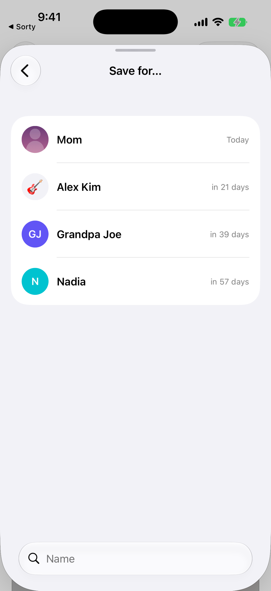
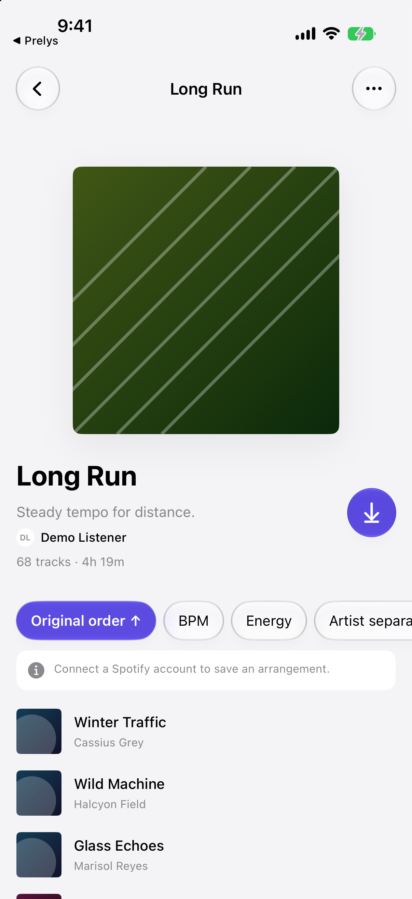
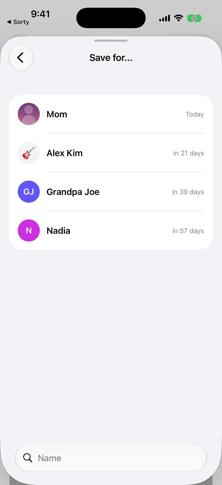
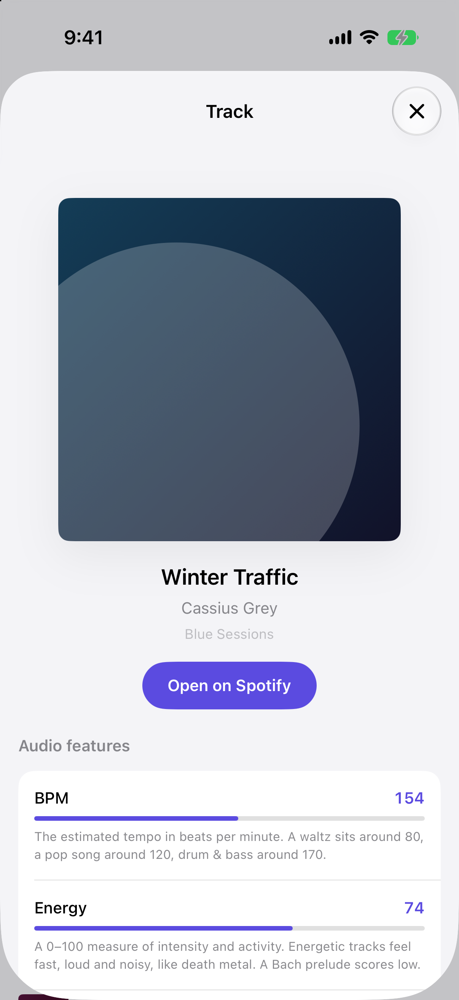

<div align="center">


# Sorty

**Reorder a Spotify playlist by the musical character of its tracks — tempo, energy, mood — and save the result back.**

Native iOS · SwiftUI · iOS 27 · no third-party packages

[](LICENSE)
[](Tests)
[](https://swift.org)

</div>

Sorty is an iOS port of **[Sort Your Music](https://github.com/plamere/SortYourMusic)**, which
[Paul Lamere](https://github.com/plamere) built in 2012 and which has been sorting playlists on the
web ever since. The idea — that a playlist reads better ordered by what the music is *doing* than by
when you happened to add it — is his.

| | | | |
|---|---|---|---|
|  |  |  |  |
| Library | Playlist | Settings | Track detail |

> [!IMPORTANT]
> **Spotify closed the endpoint this app was built on.** Sorty still works, but two of its
> twelve attributes now come from elsewhere and some playlists can never be opened at all. Read
> [Spotify's limits](#spotifys-limits) before you set it up — most surprises live there, not in the app.

## Getting started

Sorty asks for **your own** Spotify Client ID rather than shipping one. That is not friction for its
own sake: Spotify caps a development-mode app at five authorised listeners, so a shared ID would be
full after five people.

```sh
git clone https://github.com/devbyshima/sorty.git
cd sorty
xcodegen generate
open Sorty.xcodeproj
```

Then, in the app:

1. Open **Settings → Spotify app → Open Spotify Developer Dashboard** and create an app.
2. Paste its **Client ID** into the field above that button.
3. Register the **redirect URI** on the dashboard exactly as Sorty shows it, character for character.
4. Add your own Spotify account under **Users Management** on the dashboard.

Sorty requests four scopes and no more:

| Scope | Why |
|---|---|
| `playlist-read-private` | Your own private playlists, which is most of them |
| `playlist-read-collaborative` | Without it Spotify omits playlists you collaborate on **entirely** — they are not mislabelled, they never arrive |
| `playlist-modify-private` / `playlist-modify-public` | Writing the new order back |

> [!NOTE]
> A development-mode app requires its owner to hold Spotify Premium.

## What it does

The interface is built on **arrangements**, not columns
([ADR-0001](docs/adr/0001-arrangements-replace-the-column-table.md)). An *arrangement* is a named way
of ordering a playlist; an *attribute* is a property a track has. Attribute-derived orderings and
computed ones are peers.

**Twelve attributes** — Original order, Title, Artist, Release date, Date added, BPM, Energy,
Danceability, Loudness, Valence, Length, Acousticness — plus **two computed
arrangements**, Artist separation and Shuffle. 26 distinct orderings in total.

- A **chip row** carries five pinned bases that never move, a trailing chip when the applied
  arrangement is off-piste, and `More`, which lists every basis with its explanation.
- Tapping the active chip flips direction; tapping another starts ascending. Artist separation and
  Shuffle have no direction, and Shuffle's re-roll is a **separate button**, so one gesture never
  means two things.
- Rows show artwork, title, artist, the active arrangement's value, and a bar placing that value in
  the playlist's range. Ties keep original order, so sorting is stable and repeatable.
- Tracks an arrangement cannot place are gathered under **labelled groups saying why** — a podcast
  episode, a track nobody measured, a value Spotify didn't supply — rather than sinking silently.
- **Save is two actions with two gates.** Save-as-new arms on an arrangement *or* filter change;
  overwrite arms on the arrangement alone, and only for playlists you own that Spotify didn't build.
  On a playlist you don't own there is no overwrite and never will be, so **Save a Copy** is armed
  from the moment it loads — taking a copy is the point, not a duplicate.
- **Overwrite always writes the whole playlist**, never the filtered subset
  ([ADR-0002](docs/adr/0002-overwrite-always-writes-the-whole-playlist.md)). Only save-as-new may
  write a subset, and it says so.
- **Library**: All / Mine / Spotify / Others chips with counts, name search, three layouts and three
  orders, all persisted.
- **Appearance** is light or dark, both authored, followed from the device unless overridden.
- Podcast episodes render greyed, carry no acoustic values, are grouped as unrankable, and are
  preserved in place on save.

## Spotify's limits

Three of them, all outside this app's control, and all of them things people hit.

**Audio features are gone for new apps.** On **27 November 2024** Spotify restricted
`GET /v1/audio-features` — tempo, energy, danceability, loudness, valence, acousticness — to
applications that already held extended quota, and has shipped no replacement. An app registered
today gets `403` on every call, and extended quota now requires a registered company with 250k+
monthly active users.

Sorty treats the feature source as swappable (`AudioFeatureProviding`) and defaults to
**[ReccoBeats](https://reccobeats.com)**: free, no API key, keyed by Spotify track ID, on Spotify's
exact scale. Coverage is strong for catalogue up to 2024 and thin for 2025-onward releases; anything
it misses is shown as unavailable and gathered into a labelled group. The other six attributes come
straight from Spotify and always work.

**Spotify's own playlists cannot be opened.** The same November 2024 change lists *"algorithmic and
Spotify-owned editorial playlists"* as its own restricted item — Discover Weekly, Release Radar, the
Daily Mixes, the editorial lists, the charts. Sorty shows them, marks them *Can't open*, and says why
in as many words. It cannot sort them and neither can any other app at this quota tier
([ADR-0018](docs/adr/0018-spotifys-own-playlists-are-one-thing-sorty-cannot-open.md)).

Spotify sometimes lists such a playlist without describing it at all, sending a bare `null` where the
playlist should be. Those cannot be drawn — there is no name, no id, no cover — so Sorty counts them
and says so at the foot of the library rather than quietly showing you a shorter library than you
have.

> [!NOTE]
> The same rule is why Sorty cannot offer to copy an arbitrary playlist of someone else's. Copying
> needs the tracks, and Spotify sends a playlist's contents only to the people who own it or
> collaborate on it. Where Sorty *can* read a playlist — one you collaborate on — **Save a Copy**
> is there.

**February 2026 changed the endpoints again.** `/playlists/{id}/tracks` became
`/playlists/{id}/items`, `POST /users/{id}/playlists` became `POST /me/playlists`, batch `GET /albums`
was withdrawn, and `track.popularity` was removed. Contents are now returned **only** for playlists
you own or collaborate on ([ADR-0008](docs/adr/0008-a-playlist-you-do-not-own-never-opens.md)). The
client speaks the new spellings and falls back to the old ones once per session, so it works with
either vintage of Client ID.

The removed field cost Sorty an attribute. A release date survived because a track's own album still
carries one; popularity had no second source, so arranging by it ranked nothing for every listener
who was not in Demo Mode. It is gone
([ADR-0026](docs/adr/0026-popularity-is-removed.md)).

## Deliberate differences from the reference

| | Sort Your Music | Sorty | Why |
|---|---|---|---|
| Audio features | Spotify `/v1/audio-features` | ReccoBeats by default, pluggable | The Spotify endpoint 403s for any new app |
| Layout | 15-column HTML table | One attribute at a time on a list, arrangements as the primary control | 15 fixed-width columns sum to ~3.4 screens on a phone (ADR-0001) |
| Comparing attributes | Read across a row | Open the track detail sheet | The accepted cost of ADR-0001 |
| Track preview | Plays a 30s clip on row tap | Swipe a row to open in Spotify | Spotify stopped serving `preview_url` to new apps at the same time |
| Artist separation with episodes | Crashes — skips artist-less entries, then dereferences `artists[0].name` on one | Artist-less entries share a bucket and are distributed | A crash isn't worth porting faithfully |

## Architecture

```
SortyKit/          pure logic — compiled into the app AND the test target
  Models/            Spotify payloads, plus the copy layer: EmptyState, PlaylistRowText,
                     LoadFailure, LibraryNotice, SettingsText, CreditsText, FAQText,
                     Appearance, LaunchReadiness, SkeletonPlan, LibraryView
  Sorting/           Arrangement, Attribute, PlaylistSorter, ArtistSeparation, TrackRow,
                     TrackRowText, TrackDetail, UnrankableGroup, SaveAction, AttributeRange
  Spotify/           MusicService protocol, live client, CoverImageLoader
                     (+ DemoCatalog / DemoMusicService / DemoArtwork, DEBUG only)
  Features/          AudioFeatureProviding: ReccoBeats, Spotify, None
  Auth/              PKCE, Keychain token store, authenticator, configuration
  ViewModels/        SessionModel, TrackListModel (@Observable, @MainActor)
Sorty/             SwiftUI app target
  Views/Settings/    the settings page and its three sub-pages
Tests/             Swift Testing, hostless
```

**User-facing copy is a testable layer.** Anything a screen *says* — empty states, row text, badges,
unrankable-group reasons, save-action titles, every word in Settings — is decided in `SortyKit` where
a test can assert on it, not typed into a view. Views render what they are handed.

The test target compiles `SortyKit` directly and runs without an app process, so sorting, decoding,
PKCE, launch gating and save behaviour are all testable with no simulator UI and no network.

### Decisions

Architecture decisions live in [`docs/adr/`](docs/adr/), vocabulary in [`CONTEXT.md`](CONTEXT.md).

| ADR | |
|---|---|
| [0001](docs/adr/0001-arrangements-replace-the-column-table.md) | Arrangements replace the column table |
| [0002](docs/adr/0002-overwrite-always-writes-the-whole-playlist.md) | Overwrite always writes the whole playlist |
| [0003](docs/adr/0003-demo-mode-is-the-front-door.md) | ~~Demo Mode is the front door~~ — superseded by 0007 |
| [0004](docs/adr/0004-original-order-is-a-name-not-a-case.md) | Original order is a name, not a case — amended by 0026 |
| [0005](docs/adr/0005-the-reorder-threshold-is-a-thousand-rows.md) | The reorder animation snaps above 1,000 rows — measured, not guessed |
| [0006](docs/adr/0006-the-accent-is-indigo-not-green.md) | The accent is indigo, not Spotify green |
| [0007](docs/adr/0007-connecting-is-the-front-door.md) | Connecting is the front door; Demo Mode leaves the shipped app |
| [0008](docs/adr/0008-a-playlist-you-do-not-own-never-opens.md) | A playlist you don't own never opens — amended by 0017, 0018 |
| [0009](docs/adr/0009-the-library-opens-two-up.md) | The library opens two-up |
| [0010](docs/adr/0010-the-track-row-shows-no-position-number.md) | The track row shows no position number |
| [0011](docs/adr/0011-glass-is-edged-in-light.md) | Glass is edged in light |
| [0012](docs/adr/0012-the-cover-keeps-its-lean-and-loses-its-sheen.md) | The cover keeps its lean and loses its sheen |
| [0013](docs/adr/0013-the-attribution-mark-is-spotifys-own-file.md) | The attribution mark is Spotify's own file |
| [0014](docs/adr/0014-the-app-is-called-sorty.md) | The app is called Sorty |
| [0015](docs/adr/0015-waiting-is-texture-not-status.md) | Waiting is texture, not status — amended by 0019, 0020 |
| [0016](docs/adr/0016-the-way-in-is-a-reel.md) | The way in is a reel |
| [0017](docs/adr/0017-collaboration-is-a-fact-not-a-feature.md) | Collaboration is a fact, not a feature — refined by 0022 |
| [0018](docs/adr/0018-spotifys-own-playlists-are-one-thing-sorty-cannot-open.md) | Spotify's own playlists are one thing, and Sorty cannot open them |
| [0019](docs/adr/0019-a-skeleton-is-the-shape-of-what-is-coming.md) | A skeleton is the shape of what is coming, and the splash waits for one row — amended by 0020 |
| [0020](docs/adr/0020-the-placeholder-shimmers.md) | The placeholder shimmers, and one shader draws all of it |
| [0021](docs/adr/0021-a-playlist-opens-by-growing.md) | A playlist opens by growing out of the tile you touched — refined by 0024 |
| [0022](docs/adr/0022-settings-has-four-type-roles-and-its-cards-have-edges.md) | Settings has four type roles, and its cards have edges |
| [0023](docs/adr/0023-the-blur-has-no-edge-to-find.md) | The blur has no edge to find |
| [0024](docs/adr/0024-the-zoom-grows-from-the-cover.md) | The zoom grows from the cover, and the simulator lied about why it was slow |
| [0025](docs/adr/0025-fetched-covers-are-held.md) | Fetched covers are held, and the demo catalogue was hiding that they weren't |
| [0026](docs/adr/0026-popularity-is-removed.md) | Popularity is removed |
| [0027](docs/adr/0027-releases-run-on-branches-not-flags.md) | Releases run on branches, not flags |

## Development

```sh
xcodegen generate                    # after changing project.yml; never hand-edit the .xcodeproj
xcodebuild -project Sorty.xcodeproj -scheme Sorty \
  -destination 'platform=iOS Simulator,name=iPhone 17 Pro,OS=27.0' test
./scripts/screenshots.sh             # headless screenshots of every screen
SETTLE=6 ./scripts/screenshots.sh    # slower machine
./scripts/version.sh                 # the version, from its one home in project.yml
```

Branch rules and PR expectations are in [CONTRIBUTING.md](CONTRIBUTING.md).

### Releasing

`main` is the trunk and the dev channel. `release/X.Y` branches are cut from it
to stabilise a version and take **bug fixes only**; the newest one is the beta
channel, tagged `vX.Y.Z-beta.N`, and a `vX.Y.Z` tag publishes a release. A
production bug is fixed on the oldest affected release branch and merged
forward, so a fix cannot be lost
([ADR-0027](docs/adr/0027-releases-run-on-branches-not-flags.md)).

No feature flags: the binary in a listener's hand cannot be reconfigured, so a
release branch does the job a flag would do in a service.

[RELEASING.md](RELEASING.md) has the exact commands, and
[CHANGELOG.md](CHANGELOG.md) records what each version changed.

> [!NOTE]
> **Production does not yet mean the App Store.** Xcode 27 builds are
> TestFlight-only until Apple opens submissions, so a production tag currently
> means a signed archive and a published GitHub Release.

`scripts/screenshots.sh` **never drives the simulator GUI**. Every screen is reached from a cold
launch through DEBUG-only launch arguments and captured with `simctl io screenshot`. It stages into a
temp directory and replaces `screenshots/` wholesale, so a screen that no longer exists cannot leave a
stale PNG behind pretending it does.

The arguments, all compiled out of Release:

| | |
|---|---|
| `-screen <name>` | `playlists`, `tracks`, `faq`, `settings`, `spotifyApp`, `audioFeatures`, `credits`, `connect`, `signedOut`, `splash`, `profile` |
| `-demo` | the only way into the sample catalogue |
| `-playlist <id>` | which demo playlist to open |
| `-arrangement <arg>` | `bpm-descending`, `artist-separation`, `shuffle-<seed>`, … — one argument, because a basis plus a direction could name a combination that doesn't exist |
| `-sheet <name>` | `arrangements`, `filter`, `track` |
| `-track N` | which row `-sheet track` opens |
| `-filter LOW-HIGH` | a tempo range |
| `-scrolled N` | arrive N points down; `99999` means the bottom edge |
| `-layout <raw>` | `grid2`, `grid`, `list` |
| `-stallLibrary N` | hold library pages after the first, to photograph placeholders |
| `-stallTracks N` | hold a playlist's contents, to photograph the track list's placeholders |
| `-pendingCovers` | never resolve any cover |
| `-connectStep <step>` | a step of the connect flow |
| `-accent RRGGBB` | override the identity colour for one launch (how ADR-0006 was decided) |
| `-count N` | playlist size for `-screen profile` (how ADR-0005 was measured) |

> [!TIP]
> The sample catalogue is fictional — invented artists and titles with plausible acoustic values —
> so no fabricated measurement is ever attributed to a real recording. It is generated from a fixed
> seed, so screenshots and tests reproduce.

### iOS 26/27 API in use

Deployment target 27.0, Xcode 27, Swift 6.0.

- **Liquid Glass** via `.glassEffect(.regular.interactive(), in:)` on chips and top-bar buttons,
  inside a `GlassEffectContainer`. `.buttonStyle(.glass)` is deliberately not used — it sizes itself
  from its label and cannot be asked for an exact diameter.
- `Group(subviews:)` interleaves the settings cards' dividers, so a row cannot be added without one.
- `.onScrollGeometryChange(for:)`, `onGeometryChange(for:action:)`, `ScrollPosition`,
  `.lineLimit(_:reservesSpace:)`, `.visualEffect { }`, `@ScaledMetric(relativeTo:)`.
- Two Metal shaders, both placeholder-only: a sweep across the launch mark, and one that draws
  every waiting cover and text bar in the app off a single clock.
- `.navigationTransition(.zoom(sourceID:in:))` with `.matchedTransitionSource`, so a playlist grows
  out of the tile you touched.

> [!WARNING]
> **One private API.** The progressive blur behind each screen's top bar drives the `variableBlur`
> `CAFilter` through a `UIViewRepresentable` — the same filter UIKit uses for its own navigation-bar
> blurs. There is no public equivalent. It degrades to no blur at all if that API ever changes.
>
> App Store *production* uploads still require Xcode 26 and an iOS 26 SDK; Xcode 27 builds are
> TestFlight-only until Apple opens submissions.

## Credits

Sorty is an iOS port of **[Sort Your Music](https://github.com/plamere/SortYourMusic)** by
**[Paul Lamere](https://github.com/plamere)**. Sort Your Music has been sorting playlists on the web
since 2012, and the idea this app is built on is his. Sorty is an independent reimplementation in
Swift — no code from Sort Your Music is used or included.

Audio features by [ReccoBeats](https://reccobeats.com).

Not affiliated with or endorsed by Spotify. Spotify is a trademark of Spotify AB.
